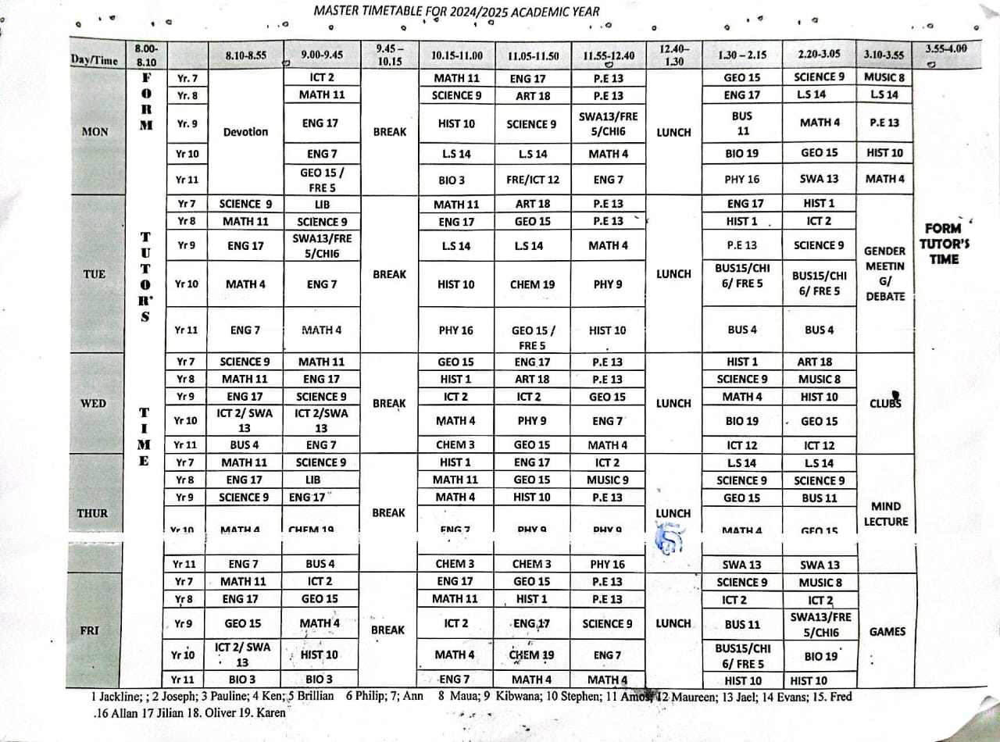

# School Timetable Implementation Guide




## Objective
Recreate the 2024/2025 academic year timetable as shown in the image using HTML and CSS. Ensure the final files are properly organized for submission.

---

## Layout Specifications

### Structure
1. **Fixed Layout**: Centered on the page with consistent dimensions.
2. **Columns**:
   - **Days** (MON-FRI): Narrow width.
   - **Time Slots** (13 periods): Equal width.
   - **Break/Lunch/Activities**: Narrower widths.
3. **Rows**:
   - **Header Row**: Time slots (8:00-4:00).
   - **Content Rows**: Yr. 7-11 for each day.

### Merging
1. **Vertical**: Breaks, lunch, and end activities span multiple year groups.
2. **Horizontal**: Combined subjects or periods span across columns.

---

## Styling Guidelines

1. **Borders**: Uniform, no double borders.
2. **Text**:
   - **Font**: Sans-serif, centered alignment.
   - **Sizes**: Larger for headers, consistent for content.
3. **Spacing**: Equal padding and consistent vertical alignment.
4. **Highlighting**: Use distinct styles for breaks and end activities.

---

## Implementation Options

1. **HTML Tables**:
   - Utilize `<table>`, `<thead>`, and `<tbody>` elements.
   - Merge cells using `rowspan` and `colspan`.

2. **CSS Grid**:
   - Define `grid-template-areas`.
   - Use `grid-row` and `grid-column` for merging cells.

---

## File Submission

### File Structure
Your project files should be organized as follows:

```
firstName_lastName/
│
├── index.html      # Main HTML file
├── style.css       # CSS stylesheet
├── README.txt      # Brief file describing the project and displaying the timetable preview screenshot 
└── timetable_preview.png # Screenshot of your timetable
```

### Naming and Submission
1. **File Name**: Compress your folder into a `.zip` file.
2. **Zip File Name**: Use your first and last name as the file name.
   - Example: `Martin_Maina.zip`
3. **Contents**: Ensure all files are included and the structure is maintained.

---

## Quality Checks

1. **Visual**: Match layout and content of the provided timetable.
2. **Technical**:
   - Valid HTML and CSS.
   - Ensure alignment and spacing.
   - Proper merging of cells.

---

**Deliverables**:
- Complete HTML and CSS files matching the timetable.
- A properly structured, zipped folder for submission.
